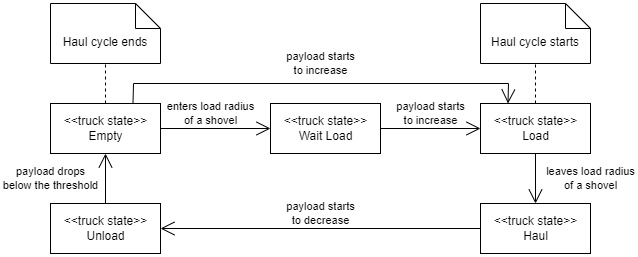

# pits

Open-pit mining system – exercise in software engineering.

**Disclaimer**: pits is not intended for use in production. It is a personal project with a goal to practice and showcase my skills.

## Business Processes

### Haul Cycles

## Architecture

|Service|Purpose|Implemented|Dependencies|
|-|-|-|-|
|Registry|- Tracks lists of entities (equipment, locations)|:heavy_check_mark:|- PostgreSQL - RabbitMQ|
|Processes|- Tracks historical data (e.g., equipment positions) - Supervises business processes (e.g., haul cycles)|:heavy_check_mark:|- PostgreSQL - RabbitMQ - Registry|
|Communicator|- Talks to mobile equipment (e.g., trucks)|:heavy_check_mark:|- RabbitMQ - Registry|
|Web App|- UI for mine personnel|:x:|- Registry - Processes|
|Mobile Equipment|- On-board computer software|:x:|- Communicator|

## Technologies

- Java 17
- Spring Boot 2
- jOOQ
- Flyway
- gRPC
- Gradle
- PostgreSQL
- RabbitMQ
- Docker

## Installation

- `docker-compose -f docker/docker-compose.yml build registry processes communicator`
- `docker-compose -f docker/docker-compose.yml up -d`

|Service|Port|Protocol|
|-|-|-|
|PostgreSQL|5432|TCP|
|RabbitMQ|5672,15672|TCP,HTTP|
|Registry|8080|HTTP|
|Processes|8081|HTTP|
|Communicator|8082,8083|HTTP,gRPC|
|Adminer|8090|HTTP|
