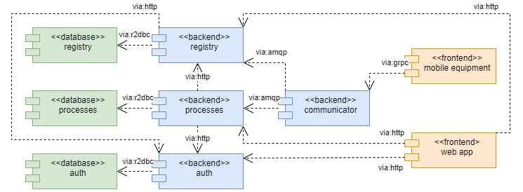

# pits

Open-pit mining system – exercise in software engineering.

## Technologies

- Java 17
- Spring Boot 2
- jOOQ
- Flyway
- gRPC
- Gradle
- PostgreSQL
- RabbitMQ
- Docker

## Architecture

|Service|Purpose|Implemented|Dependencies|
|-|-|-|-|
|Registry|Tracks lists of entities (equipment, locations)|:heavy_check_mark:|- PostgreSQL - RabbitMQ|
|Processes|- Tracks historical data (e.g., equipment positions) - Executes business processes (e.g. haul cycles)|:heavy_check_mark:|- PostgreSQL - RabbitMQ - Registry|
|Communicator|Talks to mobile equipment|:heavy_check_mark:|- RabbitMQ - Registry|
|Web App|UI for mine personnel|:x:|- Registry - Processes|
|Mobile Equipment|On-board computers (trucks, shovels)|:x:|Communicator|

## Installation

`docker-compose -f docker/docker-compose.yml up -d`

## Services

|Service|Port|Protocol|
|-|-|-|
|PostgreSQL|5432|TCP|
|RabbitMQ|5672,15672|TCP,HTTP|
|Registry|8080|HTTP|
|Processes|8081|HTTP|
|Communicator|8082|HTTP|
|Communicator|8083|gRPC|
|Adminer|8090|HTTP|
